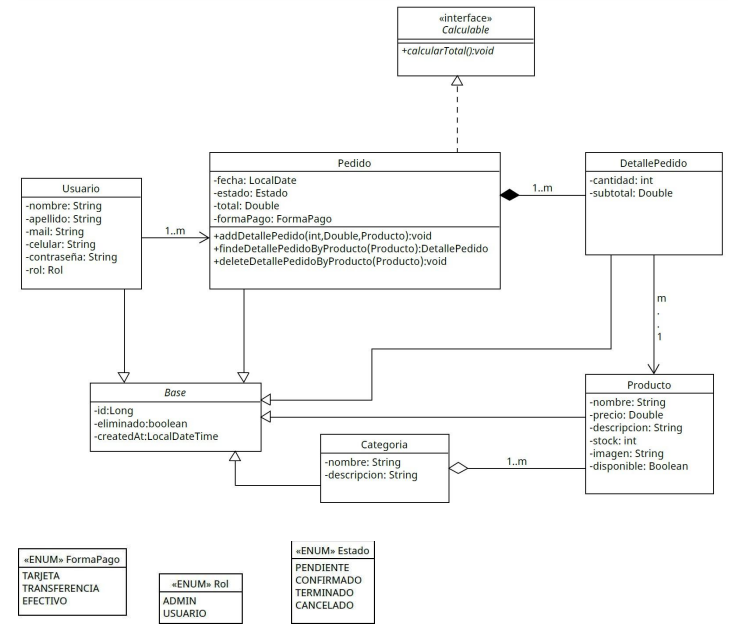

# 📚 Food Store Backend System (Java)
**Midterm Exam 2 - Programming II** 📍 *Universidad Tecnológica Nacional (UTN)*

## 📘 Project Overview
This project is a Java-based backend domain model for a "Food Store" e-commerce application. The system is built strictly following a provided UML class diagram, showcasing advanced application of Object-Oriented Programming (OOP) concepts such as inheritance, interfaces, explicit encapsulation, and complex multi-entity relationships without using external database persistence layers.

## ✨ Academic Constraints & Requirements
This assignment was completed under specific academic evaluation criteria to demonstrate comprehensive mastery of foundational and advanced POO principles:
* **Pure OOP (In-Memory Processing):** The use of JDBC, JPA, Hibernate, or any external database frameworks was strictly prohibited. All transactional logic and state changes occur completely in memory.
* **UML Model Conformance:** Fully implements all classes, interfaces, enums, and exact methods mapped out by the university's technical specification.
* **Structural Core Layout:** Focuses entirely on strong domain design and entity encapsulation without introducing service layers, controllers, or console menu interfaces.

## 🗺️ Architecture & UML Diagram
To respect the academic guidelines, the entire system layout was modeled based on the following UML class diagram. It illustrates the inheritance from the abstract `Base` class, the composition within `Pedido`, and the polymorphic behavior defined by the `Calculable` interface.



## 🚀 Key Features & Implementation

### 1. Robust Inheritance Architecture
* Every concrete domain entity extends a central abstract class named Base.
* The Base class encapsulates standard tracking and auditing properties: a unique identity (id), a deletion flag (eliminado), and a creation timestamp (createdAt).
* Implements an abstract toString() method in the base class to enforce unified and descriptive string conversions across all child domain components.

### 2. Interface Contracts & Polymorphic Behavior
* The Pedido (Order) entity implements the Calculable interface.
* Overrides the calcularTotal() contract method to iterate through the entire set of order line items (DetallePedido), computing the final order balance polymorphically.
* Lifecycle events safely trigger total calculations dynamically upon item additions or updates.

### 3. Encapsulation & Automated Recalculation
* All field variables are explicitly marked as private to safeguard object integrity.
* Safe entry accessors (getters) and mutators (setters) are provided for state maintenance.
* Advanced properties contain internal cascade triggers (e.g., updating the item quantity inside DetallePedido automatically updates its subtotal value based on the underlying product's pricing model).

### 4. Cohesive Entity Relationships & Logic
* Bidirectional Associations: Keeps structured references intact between Usuario and Pedido entities.
* Composition Control: Orders (Pedido) hold composition over line details (DetallePedido). Elements are exclusively created, tracked, and removed using encapsulated transactional methods like addDetallePedido, findDetallePedidoByProducto, and deleteDetallePedidoByProducto.

---

## 📂 Project Structure
```text
src/
└── examen/
    └── caro_valentina_parcial2/
        ├── Main.java            # Test engine instantiating complex object trees and generating standard reports
        ├── interfaces/
        │   └── Calculable.java  # Core pricing interface contract
        ├── enums/
        │   ├── Rol.java         # User permissions roles (ADMIN, USUARIO)
        │   ├── Estado.java      # Order lifecycle tracking states (PENDIENTE, CONFIRMADO, etc.)
        │   └── FormaPago.java   # Accepted billing methods (TARJETA, TRANSFERENCIA, EFECTIVO)
        └── entities/
            ├── Base.java        # Auditable root abstract class
            ├── Categoria.java   # Product categorization collections
            ├── Producto.java    # Single product specifications
            ├── Usuario.java     # User profiles managing orders
            ├── DetallePedido.java# Order item lines calculating individual line cost
            └── Pedido.java      # Full order transaction aggregate implementing Calculable
```

---

## 🛠️ Technologies Used
* **Language:** Java (Version 11 or superior compatible)
* **Paradigm:** Object-Oriented Programming (OOP)
* **Environment:** Standard Java Development Kit (JDK)

---

## 👥 Student Information
* **Name:** Valentina Lucia Caro
* **Course:** Programming II (Java)
* **Institution:** UTN - Tecnicatura Universitaria en Programación a Distancia